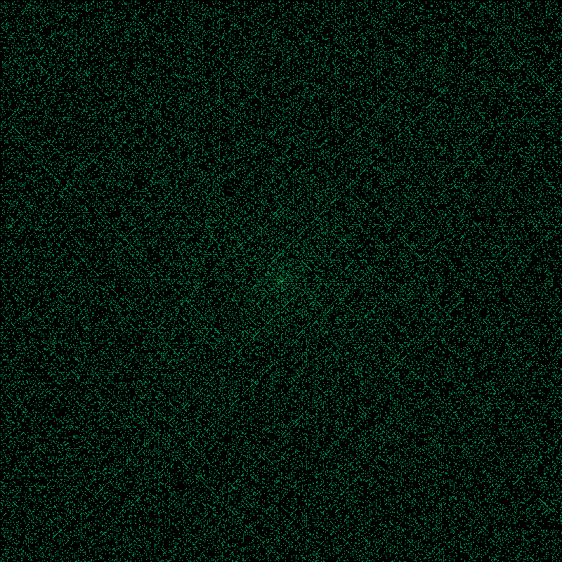

# Ulam Spiral

A simple [Ulam spiral](https://en.wikipedia.org/wiki/Ulam_spiral) generator written in Crystal.

Place integers on a grid in a spiral pattern starting from the center, then highlight the primes. What you get is unexpected: the primes line up along diagonal lines. Nobody fully understands why.

Stanisław Ulam discovered this in 1963 while doodling during a conference talk. It has been a curiosity in number theory ever since.


## Build

```sh
shards install
crystal build ulam_spiral.cr --release
```

## Usage

```sh
# White primes on black, 800x800
./ulam_spiral -w 800 -h 800

# Pick your own color
./ulam_spiral -w 1000 -h 1000 -c "#00FF88"

# Quick run without compiling first
crystal run ulam_spiral.cr -- -w 400 -h 400
```

The center pixel is always yellow. Everything else is black (background) or your chosen prime color.



## How it works

1. Start at the center of the image
2. Walk outward in a spiral (right, up, left, down, ...)
3. At each position, check if the current number is prime
4. If it is, paint that pixel

Here's a 7x7 example. First, lay out the numbers in a spiral from the center:

```
 37  36  35  34  33  32  31
 38  17  16  15  14  13  30
 39  18   5   4   3  12  29
 40  19   6  [1]  2  11  28
 41  20   7   8   9  10  27
 42  21  22  23  24  25  26
 43  44  45  46  47  48  49
```

Now keep only the primes. Notice the diagonals:

```
 37   .   .   .   .   .  31
  .  17   .   .   .  13   .
  .   .   5   .   3   .  29
  .  19   .   .   2  11   .
 41   .   7   .   .   .   .
  .   .   .  23   .   .   .
 43   .   .   .  47   .   .
```

Scale that up to thousands of pixels and the diagonals become unmistakable.

There's also a [4K example](examples/ulam_spiral_3840x2160.png) in the repo if you want to zoom in.

## Requirements

- Crystal >= 1.19
- stumpy_png (installed via shards)

## License

MIT
